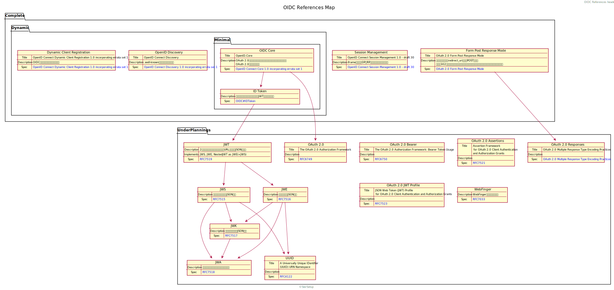

# OIDC メモ
## OIDC Reference Map
[OpenID Foundation 公式](https://openid.net/connect/) を元に関連図を作ってみた。  
新規タブで開くと、リンクが有効化された状態で閲覧できます。

<iframe src="OIDC-OIDC_References_Map.svg" style="width: 95vw; height: 95vh;"></iframe>

### 参考
[[Qiita] IDトークンが分かれば OpenID Connect が分かる](https://qiita.com/TakahikoKawasaki/items/8f0e422c7edd2d220e06)
